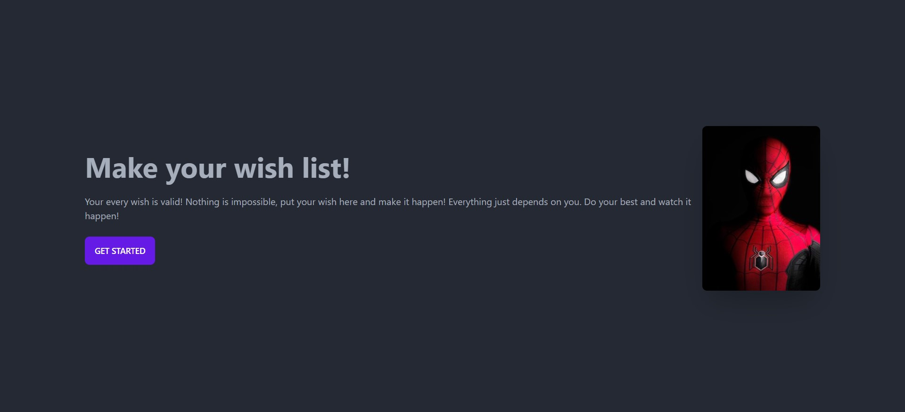
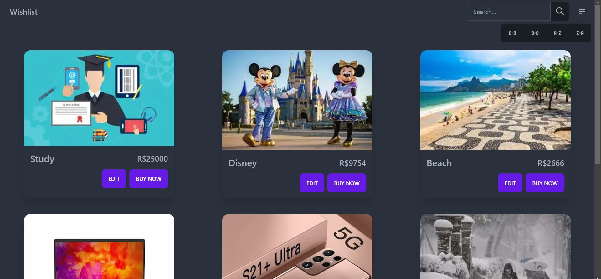
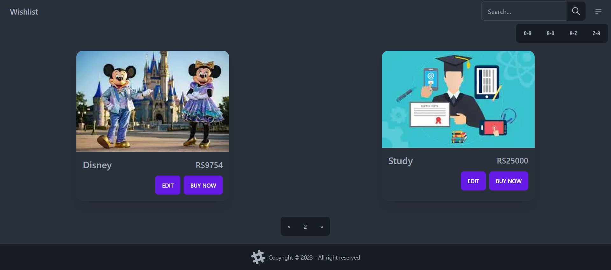
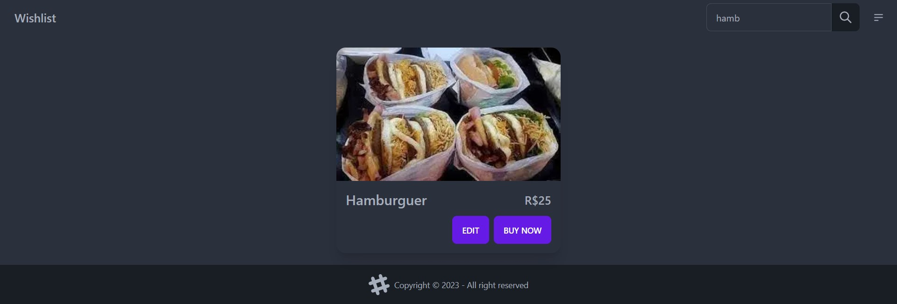
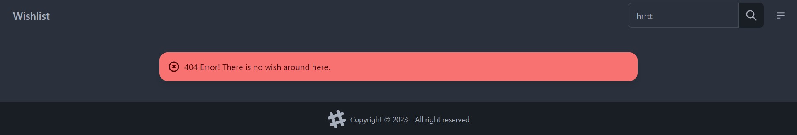
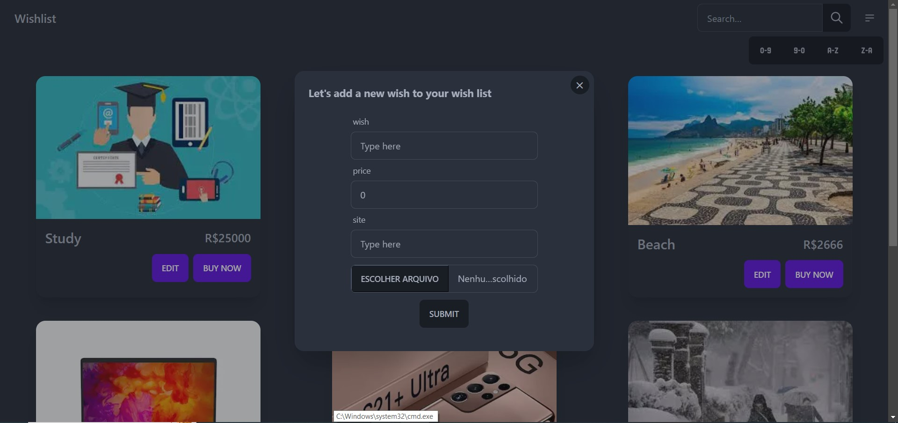
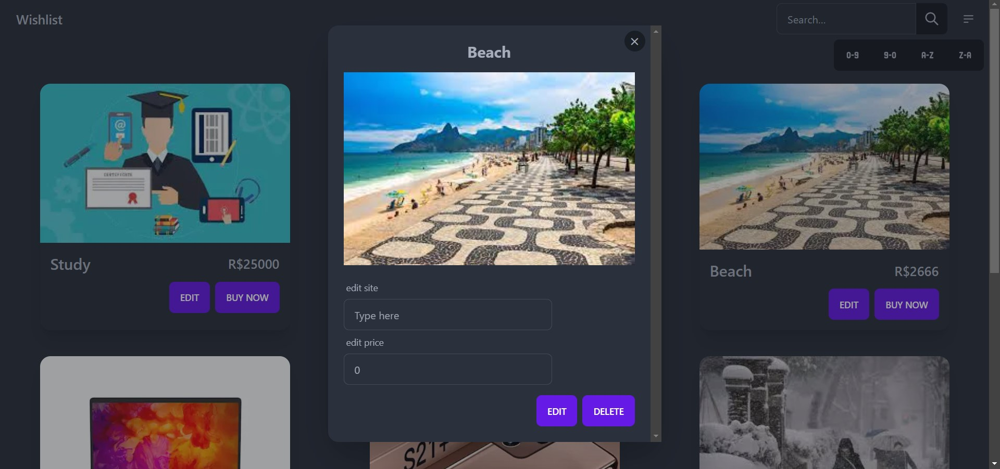

# WISHLIST

## 👀 Como ficou o frontend ???

</img>
----------
</img>
----------
</img>
----------
</img>
----------
</img>
----------
</img>
----------
</img>
----------

## ⌨️ Sobre o projeto

O projeto consiste numa api java , Ele foi criado utilizando [Spring Boot](https://start.spring.io/).

## Sobre a API

- Método GET -> /wishlist (retorna todos os desejos, é possível escolher a ordenação e a página)
- Método GET -> /wishlist/{id} (retorna o desejo do id)
- Método POST -> /wishlist (cria um desejo)
- Método PUT -> /wishlist/{id} (editar um desejo)
- Método DELETE -> /wishlist/{id} (exclui um desejo)
- Método GET -> /wishlist/search (retorna os desejos de acordo com o texto pesquisado)

## 🧑‍💻 Tecnologias usadas

O projeto foi desenvolvido com as seguintes tecnologias:
- [Java](https://www.java.com/pt-BR/)
- [MYSQL](https://www.mysql.com/)